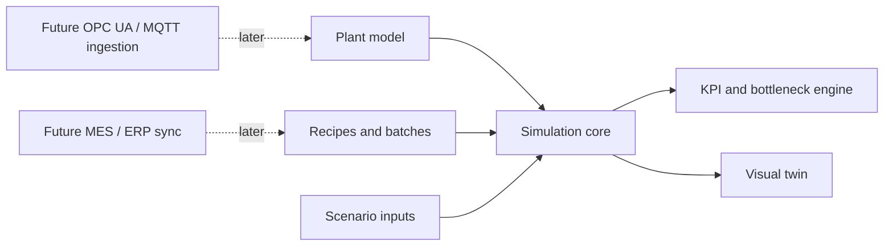

# Архитектура цифрового двойника

## Цель

Сделать offline-модель линии порошковой краски, которую можно развивать до online-двойника без смены архитектуры. На первом этапе система работает на demo-допущениях и ручных справочниках. На следующих этапах те же сущности получают реальные данные из MES, SCADA, PLC, лаборатории и учета.

## Слои системы

## Доменные сущности

- Plant: завод или производственная площадка.
- Area: зона цеха.
- Line: производственная линия.
- Equipment: единица оборудования.
- Route: маршрут производства.
- Recipe: рецептура или класс продукта.
- Batch: партия.
- Operation: операция партии на конкретном оборудовании.
- Event: простой, авария, переналадка, лабораторная проверка, отклонение.
- Signal: будущий тег оборудования или расчетный показатель.

## Offline сегодня, online завтра

На старте источники данных заменены seed-файлами и сценарными коэффициентами. Важно, что UI, симуляция и документы уже говорят на языке будущего двойника: активы, маршруты, партии, события, риски, OEE, энергия. Когда появятся реальные данные, ingestion-слой будет обновлять те же объекты.

## Будущие интеграции

- OPC UA: чтение тегов PLC/SCADA.
- MQTT Sparkplug: событийная телеметрия и edge gateways.
- MES: партии, задания, статусы операций.
- ERP/WMS: сырье, остатки, готовая продукция.
- LIMS/лаборатория: гранулометрия, цвет, gel time, протоколы качества.
